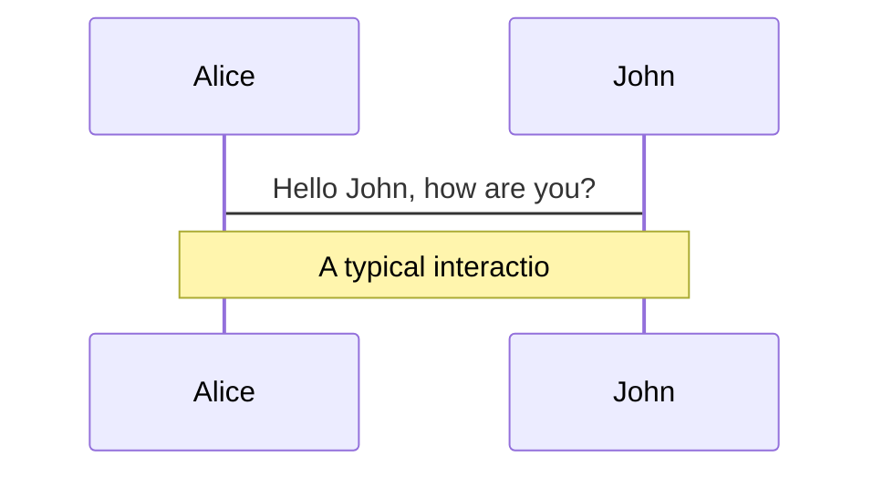

# slides制作 - slidev

---

# 谁应当使用Slidev?

- 前提: markdown使用者(包括”隐性”使用者,如Notion使用者,印象笔记使用者)
- node.js开发者,当然!
    - 他们熟悉使用Slidev所需的一切
- 其它开发者,很合理
    - 你不需要真正了解Node.js/Vite/TypeScript
    - 只要熟悉shell & 一款编辑器 & Git即可
- STEM研究生,也许?
    - 不是所有STEM研究生都熟悉上面的工具,但:
        - 花一些时间在学习使用VS Code和Git上对他们来说很值得
        - markdown → slides与LaTeX → thesis过程很相似,而他们终究是要写论文的
- 实际上,我是一名FPGA开|IC发者,主力语言是Scala,完全不懂TypeScript,但这并不妨碍我在16个小时中大致学会Sidev并编写出这个教程

---


---

# Before Slidev

- 由于我的主力知识库软件是Notion,而制作slides时往往需要使用知识库中的内容,我过去的制作流程有两种:
    1. 基于PowerPoint
        1. 从Notion上逐block复制内容到PowerPoint,并为这些内容:
        2. 恢复原有的视觉效果,如代码块效果
        3. 调整尺寸
        4. 逐页进行排版
    2. 基于Notion
        1. 将一份完整Notion原稿的内容分为多个页面
        2. 调整每个页面的布局
        3. 将这些页面组织起来,方法包括:
            1. 为页与页之间添加”上一页”,”下一页”链接
            2. 对每个页面进行截图,并将这些图片导入到PowerPoint产生一份纯图ppt

---

- 流程1的问题在于
    - PowerPoint不是我熟悉的软件
    - 大量的复制粘贴工作
    - 富文本(代码块,LaTeX,图片,网页embed)要素的重建很繁琐
    - PowerPoint中,代码块和LaTeX的展示不尽人意
    - PowerPoint中,形式和内容不是分离的,放大了排版强迫症的危害
    - .ppt的版本控制也让人恼火
- 流程2的问题在于
    - 当内容总量能够适配一页时,文字总是灾难性地太小,迫使我使用h3|h2来编写正文内容
    - Notion页面间是网状关系,通过”上一页”,”下一页”构造出的线性关系非常生硬
    - Notion无法支持一些展示时常用的功能,如演讲者视图,也无法支持动画

---

# Why Slidev?

## 作者提到的

- 让开发者通过熟悉的技术生产slides
- 形式与内容分离,避免排版强迫症
- 对代码片段的支持,包括语法高亮(对几乎所有语言),以及通过Monaco编辑器进行现场编码
- 由于基于Web技术,可以灵活修改,轻松部署

## 我关心的

- 从markdown生成 & 基于web使得Slidev可以很好地地与Notion结合,以避免编写重复内容
- 更好的版本控制
- 同时,Slidev的功能已经足够覆盖我对PPT的核心需求
    - 导出PDF - 用于提交报告,归档
    - 部署到在线站点 - 用于分享,尤其是通过GitHub Pages
    - 演讲者视图,camera和recording - 用于在线分享,尤其是学术会议,技术论坛

---

# installation

- 首先,下载和安装稳定版本的node.js,你将获得`npm`命令
    
    [https://nodejs.org/dist/v18.18.1/node-v18.18.1.tar.xz](https://nodejs.org/dist/v18.18.1/node-v18.18.1.tar.xz)
    
- 然后,你可以通过两种方式开始使用Slidev
    - 从模板开始
        - 通过`npm init slidev@latest`获得官方模板
        - 通过修改模板中的内容来产生自己的slides
    - 全局安装
        - 通过`npm i -g @slidev/cli`安装slidev/cli,你将获得`slidev`命令
        - 之后,在任何一个包含markdown(.md)文件的目录下,可以使用下面的命令产生slides
            - `slidev [entry]` - 启动本地服务器,在特定端口上展示从entry生成的slides
            - `slidev build [entry]` - 建立可托管的单页应用(single page application, SPA)
            - `slidev export [entry]` - 将slides导出为PDF或其它格式

---

# 制作slides

---

## 基本排版要素

### 分页和布局

- Slidev使用`---`进行分页,在每个页面之前,可以插入[扉页块 (front matter)](https://jekyllrb.com/docs/front-matter/),为后续页面指定布局和其它元数据
- 一个典型的扉页块如下,它使用[YAML](https://www.cloudbees.com/blog/yaml-tutorial-everything-you-need-get-started)格式
    
    ```yaml
    ---
    layout: 'center' # 布局类型
    background: './images/background-1.png' # 背景图片
    class: 'text-white'
    ---
    ```
    
- 与PowerPoint类似地,Slidev内建了多种布局类型,详见[Layouts | Slidev](https://sli.dev/builtin/layouts.html#end)
- 一定程度上,布局(layout)不是一个准确的称呼,因为一些不同的布局的差异并不在于内容的分区排布,而在于内容的样式,如cover和quote
- 从内容排布的角度,Slidev主要分为单栏和双栏布局,相比于PowerPoint无疑要更加贫瘠,但:
    - 对我来说,这反而能够减少排版强迫症带来的焦虑
    - 对于熟悉Web技术的开发者,它们可以通过Slidev渲染复杂的自定义布局

## 基本内容要素

- Slidev支持各种markdown基本要素,并为部分要素进行了增强

---

### 代码块

- 相比markdown,Slidev为代码块额外提供了
    - 语法高亮(基于Prism|Shiki)功能
    - 选择性高亮功能
    - 在线编辑(基于Monaco)功能

```scala
case class FlopocoDiv(
    exponentSize: Int,
    mantissaSize: Int,
    override val family: XilinxDeviceFamily,
    override val targetFrequency: HertzNumber
) extends BlackBox{}
```

```scala
case class FlopocoDiv(
    exponentSize: Int,
    mantissaSize: Int,
    override val family: XilinxDeviceFamily,
    override val targetFrequency: HertzNumber
) extends BlackBox{}
```

---

### 静态资源

- 与markdown一样,你可以使用本地或远程的图片
    - 远程图片
        - ``
    - 本地图片,你需要将图片放到`public`文件夹中
        - ``
    - 如果你想使用自定义的尺寸或样式，可以使用 `` 标签
        - ``


---

### 备注

- 每张slide的最后一个注释块将被视为备注,在演讲者视图中被展示

<!-- 这是一条备注 -->

---

### 图标

- Slidev 允许你在Markdown中**直接**访问几乎所有的开源的图标集(基于`[vite-plugin-icons](https://github.com/antfu/vite-plugin-icons)`和[Iconify](https://iconify.design/))
- 图标 ID 遵循 [Iconify](https://iconify.design/) 的命名规则 `{collection-name}-{icon-name}`。例如：
    - 使用 [Material Design Icons](https://github.com/Templarian/MaterialDesign)，其规则为 `<mdi-account-circle />` -<mdi-account-circle />
    - 使用 [Carbon](https://github.com/carbon-design-system/carbon/tree/main/packages/icons)，其规则为 `<carbon-badge />` - <carbon-badge />
    - 使用 [Unicons Monochrome](https://github.com/Iconscout/unicons)，其规则为 `<uim-rocket />` - <uim-rocket />
    - 使用 [Twemoji](https://github.com/twitter/twemoji)，其规则为 `<twemoji-cat-with-tears-of-joy />` - <twemoji-cat-with-tears-of-joy />
    - 使用 [SVG Logos](https://github.com/gilbarbara/logos)，其规则为 `<logos-vue />` - <logos-vue />

---

### LaTex

- 与Notion一样,Slidev基于[KaTeX](https://katex.org/)实现了对于$\LaTeX$的支持
- 内联格式: $\sqrt{3x-1}+(1+x)^2$
- 块格式:

$$
\begin{array}{c}

\nabla \times \vec{\mathbf{B}} -\, \frac1c\, \frac{\partial\vec{\mathbf{E}}}{\partial t} &
= \frac{4\pi}{c}\vec{\mathbf{j}}    \nabla \cdot \vec{\mathbf{E}} & = 4 \pi \rho \\

\nabla \times \vec{\mathbf{E}}\, +\, \frac1c\, \frac{\partial\vec{\mathbf{B}}}{\partial t} & = \vec{\mathbf{0}} \\

\nabla \cdot \vec{\mathbf{B}} & = 0

\end{array}
$$

- 与代码块类似,Slidev为$\LaTeX$提供了选择性高亮功能,以便于展示

---

### 图表

- 与Notion一样,Slidev基于[Mermaid](https://mermaid-js.github.io/mermaid)实现了对于内嵌图表的支持



---

# 实践:与Notion结合的工作流

---

## 生产内容

- 日常的内容生产仍然在Notion上进行,不过,如果希望在未来将Notion页面转换为slides,应当注意以下事项
    - 尽量在一个长页面上完成所有内容(而不是在多个子页面中),尽管Slidev支持从多个.md文件产生slides,这会增加转换工作量
    - 尽量在编写内容时就进行粗糙的分页,这可以通过插入`---`完成,你可以注意到,本页面中的水平线实际上就是分页符
    - 不要使用Notion database

---

## 转换为slides

- 首先,我们将Notion页面导出为markdown文件


- 一个典型的导出结果如下,我们需要
    - 为入口markdown文件进行重命名(否则,在启动时我们需要输入一个复杂的entry名)
    - 将资源文件夹重命名为public


---

- 然后,我们将导出后的目录移动到一个处于版本控制下的仓库中,一个典型的仓库见https://github.com/RicardoNid/slides

```
slides project
└───slidev-intro # 一个Slidev工程
|   |   slidev-intro.md # 根页面,重命名为slidev-intro.md
|		└───public # notion导出的静态资源文件夹
|   |   |   chainsaw.png
|   |
└───convolutional-code # 另一个Slidev工程
| 
....
```

---

- 然后,在工程目录下启动Slidev并开始编辑内容,你可以在浏览器上实时看到修改结果


---

- Notion导出的markdown文件,在事先通过水平线分页的情况下,几乎本身就已经是可用的slides,我们的修改集中于:
    - 去掉导出时资源文件夹的名称,使其正确链接到public文件夹,这可以通过一次全局替换完成
    - 为页面增加标题
    - 为页面选择layout
    - 为页面增加动作
- 你可以在 对比本页面导出的原始markdown文件(`original.md`)和为展示进行修改后的markdown文件(`slides.md`)的异同,我们并没有进行太多修改
- 同样地,你可以对比通过Notion看到的**本页面**和通过slidev看到的[**GitHub Pages**](https://ricardonid.github.io/)的异同,在很大程度上,我们保留了原始Notion页面的视觉效果

---

## 使用slides

### 展示

- 在目录下通过`slidev`命令,即可在本地启动
- 在展示的过程中,可以通过左下角的工具栏使用各类展示功能,详见[Installation | Slidev](https://sli.dev/guide/navigation.html)

### 存档

- 在目录下通过`slidev export`命令,即可在本地导出.pdf文件;通过`--with-clicks`,可以通过输出多页的方式保留部分动画效果,这样生成的PDF在播放时的效果非常接近slides本身
- 详见[Installation | Slidev](https://sli.dev/guide/install.html#command-line-interface-cli)或slidev

## 部署到GitHub Pages

- 在部署之前,Slidev首先通过`slidev build`将源代码构建为单页应用
- 单页应用生成后,可以在本地通过`npx vite preview`预览,或部署到服务器上
- 对于没有Web开发经验的使用者(包括我),部署到服务器是一项比较复杂的工作,不过,Slidev文档中提供了用于部署到GitHub Pages的GitHub Action,大幅简化了这一流程.下面我们将step-by-step地说明这一流程